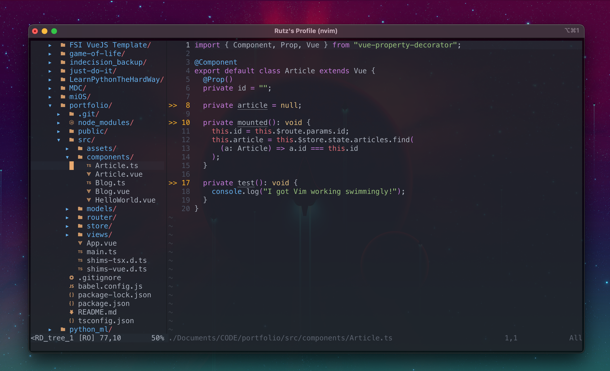

# learn Vim

[introduction](#introduction)

[launch / exit Vim](#launch--exit-vim)

[modes](#modes)

[keybindings / commands](#keybindings--commands)
- [learn these first](#learn-these-first)
- [core commands](#core-commands)
- [advanced](#advanced)
- [my-config specific](#my-config-specific)

[.vimrc](#vimrc)

[resources](#resources)

[debugging](#debugging)

[C# .NET setup](#c-net-setup)

[node.js setup](#nodejs-setup)

#

### introduction

In this document, I'll share with you how I learned Vim, listing common commands and tips to help get you started.

Vim is a text editor that runs in a CLI. You can't use a mouse with Vim. All navigation and operations are performed with keyboard shortcuts. It's used by programmers because of how quickly practiced users can navigate files and because of how customizable it is. You should know the basics of using a command prompt before following this document.

(FYI, I use Neovim, but that shouldn't change any of the instructions/commands below.)

### launch / exit Vim
- type `vim` into your terminal of choice (or `nvim` in my case)
- to open a file type `vim [path to file]`
- to exit Vim, type `:q` and hit enter
- to save changes: `:w`
- if you want to save and quit: `:wq`
- if you want to discard changes: `:q!`

### modes

- normal: When you launch Vim, you'll be in normal mode, which is when you can use all the fancy key-bindings (keyboard shortcuts) that make Vim so special. You can tell you're in normal mode because the cursor will be fat.
- insert: To actually type text, hit `i` or `a` and then start typing. (As an exercise, try and figure out the difference between i and a.) Use escape to get back into normal mode.
- visual: Visual mode happens when you hit `v` in normal mode. You can use the arrow keys (or h, j, k, l) to select text. You'll need this for copying/pasting and bulk deleting, etc.
- command: When you hit `:` in normal mode you can type commands, like `w` to save or `q` to quit or `term` to open up a terminal window.

### keybindings / commands

Now it's time to learn some handy commands that you can use in normal mode. Being good at these is what makes Vim folks so fast at writing code. These are basic commands, roughly in the order I learned them.

#### learn these first
|                      |                                                                                      |
| -------------------- | ------------------------------------------------------------------------------------ |
| h, j, k, l           | move around in the file (right, down, up, left)                                      |
| i                    | enter insert mode                                                                    |
| esc                  | go back into normal mode                                                             |
| v                    | enter visual mode so you can select text                                             |
| shift-v              | select text line-by-line                                                             |
| u                    | undo                                                                                 |
| ctrl-r               | redo                                                                                 |
| y                    | copy                                                                                 |
| p, P                 | paste below/above the current line                                                   |
| :w                   | save the current file                                                                |
| :q                   | close the current window                                                             |

#### core commands
|                        |                                                                                      |
| ---------------------- | ------------------------------------------------------------------------------------ |
| h, j, k, l             | move around in the file (right, down, up, left)                                      |
| {, }                   | move up/down the file by paragraphs                                                  |
| ctrl-u                 | move up half a page                                                                  |
| ctrl-d                 | move down half a page                                                                |
| 0, $                   | move to the beginning/end of a line                                                  |
| gg, G                  | move to top of file, bottom of file                                                  |
| ggVG                   | select all                                                                           |
| xG, :x                 | jump to line number x                                                                |
| xj, k                  | jump x lines down (j) or up (k)                                                      |
|                        |                                                                                      |
| i                      | enter insert mode                                                                    |
| I                      | enter insert mode at the beginning of the current line                               |
| a                      | enter insert mode after the cursor                                                   |
| A                      | enter insert mode at the end of the current line                                     |
| o, O                   | open a new line below/above the current line and enter insert mode                   |
| esc                    | go back into normal mode                                                             |
| v                      | enter visual mode so you can select text                                             |
| shift-v                | select text line-by-line                                                             |
| n, N                   | while searching, go to next/previous occurance                                       |
| *                      | jump to the next occurance of whatever is under the cursor                           |
| #                      | jump to the previous occurance of whatever is under the cursor                       |
|                        |                                                                                      |
| u                      | undo                                                                                 |
| ctrl-r                 | redo                                                                                 |
| x                      | delete the character under the cursor                                                |
| dd                     | delete current line                                                                  |
| dw                     | delete current word                                                                  |
| y                      | copy                                                                                 |
| yy                     | copy current line                                                                    |
| p, P                   | paste below/above the current line                                                   |
| "*y                    | copy selected text to system clipboard (so you can paste outside of the terminal)    |
| "*p                    | paste from system clipboard                                                          |
|                        |                                                                                      |
| viw                    | select the current word, no matter where in the word the cursor is                   |
| vi{ or vi(             | select the current block of code between the curly brackets or parentheses           |
| va{ or va(             | select the current block of code, including the brackets/parentheses                 |
| ya{ or ya(             | copy the current block of code and the brackets/parentheses                          |
| da{ or ca{             | delete the current block of code and the brackets/parentheses                        |
| =G                     | when at the top of the file, format the entire file                                  |
| =ap                    | format the current paragraph                                                         |
| ==                     | format current line                                                                  |
| =                      | format selected lines                                                                |
| %                      | when on bracket/parenthesis jump to its partner                                      |
|                        |                                                                                      |
| ~                      | swap the case on the current character                                               |
| ctrl-a                 | increment int                                                                        |
| ctrl-x                 | decrement int                                                                        |
|                        |                                                                                      |
| :w                     | save the current file                                                                |
| :q                     | close the current window                                                             |
| :q!                    | close the current window without saving changes                                      |
| :x or ZZ               | save and then close the current window                                               |
| zz                     | center the screen around the current line                                            |
| /[search term]         | search file with Regex                                                               |
| :noh                   | "no highlight", clears highlighting on search results                                |
| :%s/[one]/[two]/g      | replaces all instances of "one" with "two" for all (%) lines                         |
| ctrl-ww                | switch windows (for when you have multiple panels open)                              |
| ctrl-wq                | close current window or tab                                                          |
| ctrl-wv                | open a new vertically split window                                                   |
| ctrl-ws                | open a new horizontally split window                                                 |
| ctrl-w then h, j, k, l | move to the next window in the x direction, where x is h, j, k, or l                 |
| ctrl-w then ctrl-r     | rotate windows                                                                       |
| gt, gT                 | switch tabs (forward/back)                                                           |
| #gt                    | switch to tab number #                                                               |
| :tabm [n]              | move the current tab into the nth position (note: tabs are zero-indexed              |
| :enew                  | open an empty, blank buffer                                                          |
| :term                  | open a terminal window (replaces current window)                                     |
| :vsplit term://zsh     | open a (in my case) zsh terminal to the right of the current window                  |
| :tabnew term://zsh     | open a (in my case) zsh terminal in a new tab                                        |

#### advanced
|                               |                                                                               |
| ----------------------------- | ----------------------------------------------------------------------------- |
| ctrl-o | jump to the previous place the cursor was at |
| ctrl-i | jump forward to a more recent place the cursor was at |
| gi | jump to last insert |
| gv | jump to last select |
| gj | go down one visual line, not actual line |
| cc | delete line and enter input mode |
| yap, dap, cap, vap | yank/delete/select contiguous code (current paragraph) |
| vip vs. vap | vap selects the line below the paragraph as well |
| o | in visual mode, moves your cursor between the beginning/end of the selection |
| >>, << | indent/undent current selection |
| >4j | indent current line and 4 lines below |
| q or q [register name] | start/stop recording |
| @[register name] | apply above recording to current line |
| 10@[register name] | to apply recording to 10 lines |
| :normal [some set of keybindings] | apply key bindings to all selected lines |
| :!sort | use UNIX `sort` command to sort selected lines |
| :.!jq | format json (not perfect, but mostly works) |

#### my-config specific
|                      |                                                                                        |
| -------------------- | -------------------------------------------------------------------------------------- |
| ctrl-c               | copy to system clipboard                                                               |
| ctrl-v               | paste from system clipboard                                                            |
| ctrl-y               | select an intellisense option from the list                                            |
| cmd-/                | comment/uncomment selected code                                                        |
| Zl                   | correct the spelling of the word under the cursor                                      |
| ZL                   | display a list of spelling suggestions for the word under the cursor                   |
| <leader>z            | open up NERDTree                                                                       |
| r                    | refresh file listing in NERDTree for current directory                                 |
| R                    | refresh file listing in NERDTree for root directory                                    |
| \<leader>p           | replace currently selected text with default register without yanking it               |
| \<leader>ff          | find files in `pwd`                                                                    |
| \<leader>fl          | search files for text                                                                  |
| \<leader>fb          | open file browser                                                                      |
| \<leader>fp          | find files in specified path                                                           |
| \<leader>h           | remove highlights                                                                      |
| \<leader>t           | toggle terminal window                                                                 |
| s                    | open up file in vertical split mode with NERDTree                                      |
| t                    | open up file in a new tab with NERDTree                                                |
| \<leader>td          | open my list of TODOs for the `pwd`                                                    |
| \<leader>ww          | open my [VimWiki](http://vimwiki.github.io/)                                           |
| F12 (depreciated)    | jump to definition (see note below)                                                    |
| F8                   | toggle project structure map, courtesy of [taglist.vim](https://vim-taglist.sourceforge.net/index.html) plugin |

**note**: Install `ctags` on your machine and run `ctags -R --exclude=.git .` in your project's root folder to index your project and enable definition-jumping. I then remapped `ctrl-]` to `F12` to use that popular shortcut for go to definition.

**another note**: To get `cmd-/` to work (the way it does in VSCode) I had to remap nerdcommenter's `NERDCommenterToggle` to `++`. (Any unused keybinding should work.) Then in iTerm2 preferences I added a binding for `cmd-/` to send `++` as text. You can see the two lines in my `init.vim` for reference.

#

### .vimrc

The weirdest thing about Vim for most people is that it runs in a terminal. It's boring and ugly! That's why you customize the heck out of it. My setup literally looks like my VSCode window, except that it's faster to launch and faster to code in. You customize Vim by editing the `.vimrc` file that lives in your home directory. If it's not there, simply create a file with the name `.vimrc`. I'll include [my config file](https://github.com/ruthrootz/learn-vim/blob/main/init.vim) in this repo so you can get a taste. (For Neovim the config file is called `init.vim` and lives in `~/.config/nvim/`.) Having this config file makes it incredibly easy to set up your environment on a different computer.

`Plug` is a plugin manager, so that's the first thing I installed, then I used plug to install a bunch of plugins, and the last section of the file is where I set various settings, some that are built into Vim and some that are for the plugins. There are also a few custom keybindings in there. Run `:PlugInstall` while in Vim to install the plugins.

Advice for MacOS users: To get [NERDTree](https://github.com/preservim/nerdtree) to work with the [devicons](https://github.com/ryanoasis/vim-devicons) plugin, I had to install a ["nerd font"](https://www.nerdfonts.com/) onto my computer. For MacOS all you have to do is download the nerd font of your choice, install it (which will add it to Font Book) and then make sure your terminal app uses that font for non-unicode characters. (You can't use MacOS's default Terminal app if you want cool colors, fyi, since Terminal doesn't allow more than a handful of different colors. I use iTerm2.)

When you see <leader> in the tables above, it means, in my case, spacebar. You can set the leader key to be any unused key.

In System Preferences I remapped my caps lock key to be my escape key so it's easier/faster to exit insert/visual mode.

#

### resources

Fantastic [video series by ThePrimeagen](https://www.youtube.com/playlist?list=PLm323Lc7iSW_wuxqmKx_xxNtJC_hJbQ7R) for learning Vim movements, going from beginner to expert.

For more info on customizing, see [this article](https://medium.com/better-programming/setting-up-neovim-for-web-development-in-2020-d800de3efacd). It's the one I followed to get Vim to look like this:

#

### debugging

I'm using [vimspector](https://github.com/puremourning/vimspector) for debugging. I'm still getting things set up by following [this doc](https://puremourning.github.io/vimspector-web/)...

After installing the plugin, I got an error that went something like, `Vimspector Unavailable: requires Vim compiled with python (3.6.0+) support.` To solve this issue, I had to install python3 on my machine and then install [this Python package](https://pypi.org/project/neovim/) as specified in [this doc](https://github.com/deoplete-plugins/deoplete-jedi/wiki/Setting-up-Python-for-Neovim#a-brief-overview-of-neovim--python).
